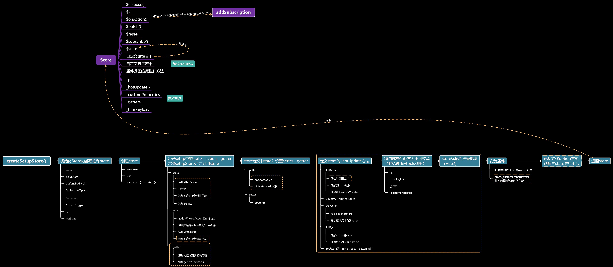
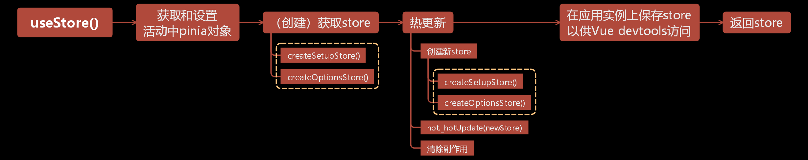
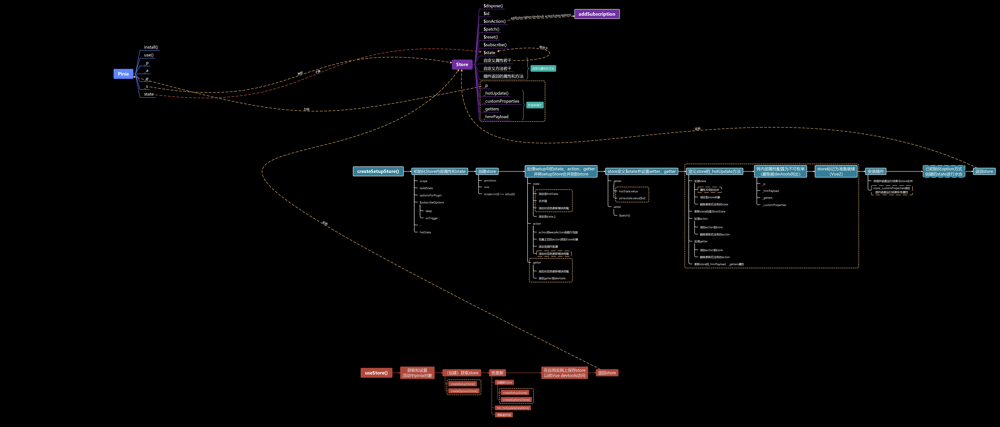

<a name="ASTtH"></a>
# 简单的调试方法
Pinia想要在webstrom上调试比较简单的方式是依靠Vue项目：

1. Vue项目下载Pinia插件
1. Vue项目中使用插件并定义Store
1. 打开文件`node_modules/pinia/dist/pinia.mjs`
1. 在需要调试的位置打上断点
1. 运行Vue项目
1. ctrl+shift+左键点击即可开始调试
<a name="JCMmb"></a>
# Pinia实例
Pinia实例并没有构造函数，而是通过工厂函数`createPinia`创建，返回的Pinia对象提供插件安装方法和其他一系列方法和属性：
```typescript
/**
 * 创建应用程序使用的Pinia实例
 */
export function createPinia (): Pinia {
  const scope = effectScope(true)
  // 注: 在这里，我们可以检查窗口对象的状态，并直接设置它，如果有类似的Vue 3 SSR
  const state = scope.run(() => ref<Record<string, StateTree>>({}))!

  //已安装插件
  let _p: Pinia['_p'] = []
  // 调用app.use(pinia)前添加的待安装插件
  let toBeInstalled: PiniaPlugin[] = []

  //使Pinia对象永远不会转换成Proxy
  const pinia: Pinia = markRaw({
    //pinia被安装时调用
    install (app: App) {
      // 这允许在安装pinia的插件后在组件设置之外调用useStore()
      setActivePinia(pinia)
      if (!isVue2) {
        pinia._a = app
        app.provide(piniaSymbol, pinia)
        //相当于Vue.prototype.$pinia = pinia
        app.config.globalProperties.$pinia = pinia
        /* istanbul ignore else */
        if (__DEV__ && IS_CLIENT) {
          //如果是客户端开发模式则注册开发工具
          // @ts-expect-error: weird type in devtools api
          registerPiniaDevtools(app, pinia)
        }
        //将添加的插件转移到_p属性中，然后清空
        toBeInstalled.forEach((plugin) => _p.push(plugin))
        toBeInstalled = []
      }
    },

    use (plugin) {
      //没有绑定Vue实例并且不是Vue2的话添加到带安装插件，否则添加到已安装插件
      if (!this._a && !isVue2) {
        toBeInstalled.push(plugin)
      } else {
        _p.push(plugin)
      }
      return this
    },

    //已安装插件
    _p,
    // 绑定的应用程序实例，这里实际上是不确定的
    // @ts-expect-error
    _a: null,
    //附着Pinia的作用范围
    _e: scope,
    //此Pinia实例使用的store映射
    _s: new Map<string, StoreGeneric>(),
    state
  })

  // pinia devtools仅依赖开发功能，因此除非使用Vue的开发版本，否则不能强制使用它们
  if (__DEV__ && IS_CLIENT) {
    pinia.use(devtoolsPlugin)
  }

  return pinia
}
```


<a name="LNqY1"></a>
# defineStore函数：创建Store
`packages/pinia/src/store.ts`是Pinia的核心文件，定义Store代码都在这个文件中。所以Store相关代码只需要看这个文件即可
<a name="swAwo"></a>
## $patch函数
`$patch`基于`store.$state`对象上添加补丁；因此新增属性是不会更新到刀`Store`对象上：
```typescript
//为Store打补丁的方法
function $patch (stateMutation: (state: UnwrapRef<S>) => void): void
function $patch (partialState: DeepPartial<UnwrapRef<S>>): void
function $patch (
  partialStateOrMutator:
    | DeepPartial<UnwrapRef<S>>
    | ((state: UnwrapRef<S>) => void)
): void {
  let subscriptionMutation: SubscriptionCallbackMutation<S>
  isListening = false
  // 重置调试器事件，因为补丁是同步的
  /* istanbul ignore else */
  if (__DEV__) {
    debuggerEvents = []
  }
  if (typeof partialStateOrMutator === 'function') {
    // 传入的target其实是store.$state，所以更新的其实是这个对象，
    // 所以如果是新增而不是修改的话是不会更新到store对象中的
    partialStateOrMutator(pinia.state.value[$id] as UnwrapRef<S>)
    subscriptionMutation = {
      type: MutationType.patchFunction,
      storeId: $id,
      events: debuggerEvents as DebuggerEvent[]
    }
  } else {
    // 传入的target其实是store.$state，所以更新的其实是这个对象，
    // 所以如果是新增而不是修改的话是不会更新到store对象中的
    mergeReactiveObjects(pinia.state.value[$id], partialStateOrMutator)
    subscriptionMutation = {
      type: MutationType.patchObject,
      payload: partialStateOrMutator,
      storeId: $id,
      events: debuggerEvents as DebuggerEvent[]
    }
  }
  isListening = true
  // 手动调用订阅方法以重新启用观察者
  triggerSubscriptions(
    subscriptions,
    subscriptionMutation,
    pinia.state.value[$id] as UnwrapRef<S>
  )
}
```
而`mergeReactiveObjects`函数则是利用递归深度合并对象：
```typescript
//递归合并响应式对象
function mergeReactiveObjects<T extends StateTree> (
  target: T,
  patchToApply: DeepPartial<T>
): T {
  // 无需遍历符号，因为无论如何它们都无法序列化
  for (const key in patchToApply) {
    const subPatch = patchToApply[key]
    const targetValue = target[key]
    if (
      isPlainObject(targetValue) &&
      isPlainObject(subPatch) &&
      !isRef(subPatch) &&
      !isReactive(subPatch)
    ) {
      target[key] = mergeReactiveObjects(targetValue, subPatch)
    } else {
      // @ts-expect-error: subPatch is a valid value
      target[key] = subPatch
    }
  }

  return target
}
```
<a name="oAlH9"></a>
## $subscribe函数
$subscribe函数订阅state变化，整个函数做了三件事情：

1. 添加回调到订阅回调队列并返回删除回调的函数
1. 添加state监听，其回调是传入的回调，返回结果是删除监听函数
1. 返回调用两个删除函数的函数
```typescript
//订阅state变化。添加订阅回调到订阅回调队列，然后返回移除观察函数
$subscribe (callback, options = {}) {
  const _removeSubscription = addSubscription(
    subscriptions,
    callback,
    options.detached
  )
  const stopWatcher = scope.run(() =>
    //监听当前Store的state，如果发生变化就触发事件（当前处于监听状态时）
    watch(
      () => pinia.state.value[$id] as UnwrapRef<S>,
      (state) => {
        if (isListening) {
          callback(
            {
              storeId: $id,
              type: MutationType.direct,
              events: debuggerEvents as DebuggerEvent
            },
            state
          )
        }
      },
      assign({}, $subscribeOptions, options)
    )
  )!

  const removeSubscription = () => {
    stopWatcher()
    _removeSubscription()
  }

  return removeSubscription
}
```
addSubscription函数添加回调到队列中，然后再返回删除回调的函数：
```typescript
/**
 * 添加订阅回调并返回删除订阅的函数
 * @param {T[]} subscriptions 订阅回调队列
 * @param {T} callback 回调函数
 * @param {boolean} detached 是否分离
 * @return {() => void} 返回删除订阅函数的函数
 */
export function addSubscription<T extends _Method> (
  subscriptions: T[],
  callback: T,
  detached?: boolean
) {
  //添加订阅回调
  subscriptions.push(callback)

  //删除订阅
  const removeSubscription = () => {
    const idx = subscriptions.indexOf(callback)
    if (idx > -1) {
      subscriptions.splice(idx, 1)
    }
  }

  //不分离并且当前存在应用实例，则应用卸载时删除回调（默认情况）
  if (!detached && getCurrentInstance()) {
    onUnmounted(removeSubscription)
  }

  return removeSubscription
}
```
<a name="FKLyT"></a>
## wrapAction函数
`wrapAction`函数的目的有三个：

1. 设置当前活动的`Pinia`对象
1. 绑定action函数的`this`
1. 兼容Vue Devtools

其中大部分代码都是为了兼容Vue Devtools：
```typescript
/**
 * 包装处理订阅的操作。
 *
 * @param name - 操作名称
 * @param action - 要换行的动作
 * @returns 用于处理订阅的包装操作
 */
function wrapAction (name: string, action: _Method) {
  return function (this: any) {
    setActivePinia(pinia)
    //参数转数组
    const args = Array.from(arguments)

    let afterCallback: (resolvedReturn: any) => any = noop
    let onErrorCallback: (error: unknown) => unknown = noop

    function after (callback: typeof afterCallback) {
      afterCallback = callback
    }

    function onError (callback: typeof onErrorCallback) {
      onErrorCallback = callback
    }

    // @ts-expect-error
    triggerSubscriptions(actionSubscriptions, {
      args,
      name,
      store,
      after,
      onError
    })

    let ret: any
    try {
      //this是Store对象，而使用setup方式创建的Store对象拿不到this
      ret = action.apply(this && this.$id === $id ? this : store, args)
    } catch (error) {
      // 处理同步错误
      if (onErrorCallback(error) !== false) {
        throw error
      }
    }

    //如果action的结果是期约，则返回期约
    if (ret instanceof Promise) {
      return ret
        .then((value) => {
          const newRet = afterCallback(value)
          // 如果afterCallback没有返回值，则返回期约解决值是value
          return newRet === undefined ? value : newRet
        })
        .catch((error) => {
          if (onErrorCallback(error) !== false) {
            return Promise.reject(error)
          }
        })
    }

    // 如果afterCallback没有返回值，则返回ret
    const newRet = afterCallback(ret)
    return newRet === undefined ? ret : newRet
  }
}
```
<a name="UXHFe"></a>
## _hotUpdate函数
`_hotUpdate`函数将传入Store的state、action、getter添加到原有Store对象上并删除传入Store没有的属性，最后再更新`_hmrPayload`、`_getters`、`_hotUpdating`三个属性：
```typescript
store._hotUpdate = markRaw((newStore) => {
  store._hotUpdating = true
  //遍历state并添加到Store对象
  newStore._hmrPayload.state.forEach((stateKey) => {
    //属性冲突
    if (stateKey in store.$state) {
      const newStateTarget = newStore.$state[stateKey]
      const oldStateSource = store.$state[stateKey]
      if (
        typeof newStateTarget === 'object' &&
        isPlainObject(newStateTarget) &&
        isPlainObject(oldStateSource)
      ) {
        //普通对象则将旧state打补丁到新state
        patchObject(newStateTarget, oldStateSource)
      } else {
        // 否则转移响应数据
        newStore.$state[stateKey] = oldStateSource
      }
    }
    // 将属性响应化，然后添加到store对象中
    set(store, stateKey, toRef(newStore.$state, stateKey))
  })

  // 删除不在新state的属性
  Object.keys(store.$state).forEach((stateKey) => {
    if (!(stateKey in newStore.$state)) {
      del(store, stateKey)
    }
  })

  // 为了避免devtools记录突变，需要先暂停监听
  isListening = false
  pinia.state.value[$id] = toRef(newStore._hmrPayload, 'hotState')
  isListening = true

  //设置action到store对象中
  for (const actionName in newStore._hmrPayload.actions) {
    const action: _Method = newStore[actionName]

    set(store, actionName, wrapAction(actionName, action))
  }

  // 设置getter到store对象
  for (const getterName in newStore._hmrPayload.getters) {
    const getter: _Method = newStore._hmrPayload.getters[getterName]
    const getterValue = buildState
      ? // option模式下创建的Store需要设置this为store
      computed(() => {
        setActivePinia(pinia)
        return getter.call(store, store)
      })
      : getter

    set(store, getterName, getterValue)
  }

  // 删除新store中没有的getter
  Object.keys(store._hmrPayload.getters).forEach((key) => {
    if (!(key in newStore._hmrPayload.getters)) {
      del(store, key)
    }
  })

  // 删除新store中没有的action
  Object.keys(store._hmrPayload.actions).forEach((key) => {
    if (!(key in newStore._hmrPayload.actions)) {
      del(store, key)
    }
  })

  // 更新devtools中使用的值，并允许稍后删除新属性
  store._hmrPayload = newStore._hmrPayload
  store._getters = newStore._getters
  store._hotUpdating = false
})
```
<a name="DeHtY"></a>
## createSetupStore函数
`createSetupStore`函数是Pinia的核心函数，不管是组合式还是选项式定义Store，都会调用这个函数。
<a name="MAPH8"></a>
### 创建Store对象
Store对象包含众多属性，包括固有属性、开发模式特有属性、vue2特有属性、setup函数返回的自定义属性，pinia分成三个变量来创建Store对象，最终合并到store变量中：
```typescript
//定义Store对象的固有属性、方法
const partialStore = {
  _p: pinia,
  // _s: scope,
  $id,
  $onAction: addSubscription.bind(null, actionSubscriptions),
  $patch,
  $reset,
  //订阅state变化。添加订阅回调到订阅回调队列，然后返回移除观察函数
  $subscribe (callback, options = {}) {
    const _removeSubscription = addSubscription(
      subscriptions,
      callback,
      options.detached
    )
    const stopWatcher = scope.run(() =>
      //监听当前Store的state，如果发生变化就触发事件（当前处于监听状态时）
      watch(
        () => pinia.state.value[$id] as UnwrapRef<S>,
        (state) => {
          if (isListening) {
            callback(
              {
                storeId: $id,
                type: MutationType.direct,
                events: debuggerEvents as DebuggerEvent
              },
              state
            )
          }
        },
        assign({}, $subscribeOptions, options)
      )
    )!

    const removeSubscription = () => {
      stopWatcher()
      _removeSubscription()
    }

    return removeSubscription
  },
  $dispose
} as _StoreWithState<Id, S, G, A>

/* istanbul ignore if */
if (isVue2) {
  // vue2，标记为未准备就绪
  partialStore._r = false
}

//利用vue的响应系统创建store
const store: Store<Id, S, G, A> = reactive(
  assign(
    __DEV__ && IS_CLIENT
      ? // devtools自定义属性（开发环境下才有）
      {
        _customProperties: markRaw(new Set<string>()),
        _hmrPayload
      }
      : {},
    partialStore
    // 后面会将setupStore合并到当前对象
  )
) as unknown as Store<Id, S, G, A>

// 将Store存储到映射中，方便存取值
pinia._s.set($id, store)

//根据setup函数运行结果创建响应对象
const setupStore = pinia._e.run(() => {
  scope = effectScope()
  return scope.run(() => setup())
})!
```
<a name="WNZe1"></a>
### 处理state、action、getter
创建完成之后需要处理`setupStore`中的`state`、`action`、`getter`，这里是直接遍历。<br />​

非计算值Ref和Reactive会被认定为`state`，只会处理下面两种情况的`state`：

1. 热更新开发环境下会添加到`hotState`​
1. setup模式（根据`options.state`判断）
   1. 已经存在对应`state`且应该水合则进行水合
   1. 将`state`更行到`pinia.state.value[$id]`（等价于`store.$state`）
```typescript
//处理state（非响应数据不处理，所以也不会添加到state）
if ((isRef(prop) && !isComputed(prop)) || isReactive(prop)) {
  // 将其标记为要序列化的状态
  if (__DEV__ && hot) {
    set(hotState.value, key, toRef(setupStore as any, key))
  } else if (!buildState) {
    // buildState有值则代表是createOptionStore调用的（直接在pinia.state.value中设置状态），所以跳过
    // 在setup创建store模式中，我们必须将state与用户刚刚创建的refs进行水合并同步pinia状态树
    if (initialState && shouldHydrate(prop)) {
      if (isRef(prop)) {
        prop.value = initialState[key]
      } else {
        // 可能是响应对象，递归合并
        mergeReactiveObjects(prop, initialState[key])
      }
    }
    // 将ref传输到pinia的state以保持所有内容同步,pinia.state.value[$id]等价于store.$state
    /* istanbul ignore if */
    if (isVue2) {
      set(pinia.state.value[$id], key, prop)
    } else {
      pinia.state.value[$id][key] = prop
    }
  }

  /* istanbul ignore else */
  if (__DEV__) {
    _hmrPayload.state.push(key)
  }
}
```
​

因为pinia没有mutation，所以函数认定为action；热更新开发环境下不作处理，其他情况下使用`wrapAction()`包装action：
```typescript
else if (typeof prop === 'function') {
  // 如果是函数则代表是action
  // @ts-expect-error: we are overriding the function we avoid wrapping if
  const actionValue = __DEV__ && hot ? prop : wrapAction(key, prop)
  // 将action添加到setupStore上
  /* istanbul ignore if */
  if (isVue2) {
    set(setupStore, key, actionValue)
  } else {
    // @ts-expect-error
    setupStore[key] = actionValue
  }

  /* istanbul ignore else */
  if (__DEV__) {
    _hmrPayload.actions[key] = prop
  }

  // 列出操作，以便它们可以在插件中使用
  // @ts-expect-error
  optionsForPlugin.actions[key] = prop
}
```

<br />非开发环境getter不作处理，而开发环境需要记录荷载（以供Vue devtools使用）和`setupStore._getters`添加对应键名（客户端）：
```typescript
else if (__DEV__) {
  // 为devtools添加getter
  if (isComputed(prop)) {
    _hmrPayload.getters[key] = buildState
      ? // @ts-expect-error
      options.getters[key]
    : prop
    if (IS_CLIENT) {
      const getters: string[] =
            // @ts-expect-error: it should be on the store
            setupStore._getters || (setupStore._getters = markRaw([]))
      getters.push(key)
    }
  }
}
```
<a name="WcfqE"></a>
### 合并store并定义$state
处理完state、action、getter之后需要将`setupStore`合并到`store`，然后将定义$state存取器，使得**pinia.state.value[$id]等价于store.$state**：
```typescript
// setupStore处理完之后合并到store对象
/* istanbul ignore if */
if (isVue2) {
  Object.keys(setupStore).forEach((key) => {
    set(
      store,
      key,
      // @ts-expect-error: valid key indexing
      setupStore[key]
    )
  })
} else {
  assign(store, setupStore)
}

// 使用此功能代替带有setter的计算，以便能够在任何地方创建它，而无需将计算的使用寿命链接到首次创建存储的任何位置。
Object.defineProperty(store, '$state', {
  //将store.$state与pinia.state.value[$id]/hotState相关联
  get: () => (__DEV__ && hot ? hotState.value : pinia.state.value[$id]),
  set: (state) => {
    /* istanbul ignore if */
    if (__DEV__ && hot) {
      throw new Error('cannot set hotState')
    }
    $patch(($state) => {
      assign($state, state)
    })
  }
})
```
<a name="P7Zg0"></a>
### 内部属性配置为不可枚举（开发环境）
为了防止内部属性被Vue devtools列举出来，利用[Object.defineProperty()](https://developer.mozilla.org/zh-CN/docs/Web/JavaScript/Reference/Global_Objects/Object/defineProperty)
将内部属性配置为不可枚举：
```typescript
//不可枚举配置
const nonEnumerable = {
  writable: true,
  configurable: true,
  // 避免在尝试显示此属性的devtools上发出警告
  enumerable: false
}

if (IS_CLIENT) {
  // 避免在devtools中列出内部属性（不可枚举属性不会被列出）
  ;(
    ['_p', '_hmrPayload', '_getters', '_customProperties'] as const
  ).forEach((p) => {
    Object.defineProperty(store, p, {
      value: store[p],
      ...nonEnumerable
    })
  })
}
```
<a name="Wgkp7"></a>
### 安装插件
```typescript
// 安装所有插件
pinia._p.forEach((extender) => {
  /* istanbul ignore else */
  if (__DEV__ && IS_CLIENT) {
    const extensions = scope.run(() =>
      extender({
        store,
        app: pinia._a,
        pinia,
        options: optionsForPlugin
      })
    )!
    //添加扩展项到自定义属性
    Object.keys(extensions || {}).forEach((key) =>
      store._customProperties.add(key)
    )
    //将插件返回的内容添加到store对象
    assign(store, extensions)
  } else {
    //将插件返回的内容添加到store对象
    assign(
      store,
      scope.run(() =>
        extender({
          store,
          app: pinia._a,
          pinia,
          options: optionsForPlugin
        })
      )!
    )
  }
})
```
<a name="c8vDh"></a>
### 流程图

<a name="PWdWu"></a>
## createOptionsStore函数
`createOptionsStore`函数的核心是`setup`函数，`setup`函数将`options`上的`state`、`actions`、`getters`合并到state上并返回合并结果，由`createSetupStore`函数调用并返回新建的`store`：
```typescript
function setup () {
  //没有已初始化state则初始化
  if (!initialState && (!__DEV__ || !hot)) {
    /* istanbul ignore if */
    if (isVue2) {
      set(pinia.state.value, id, state ? state() : {})
    } else {
      pinia.state.value[id] = state ? state() : {}
    }
  }

  // 将state转换为原生数据，方便createSetupStore生成store
  // ？避免在pinia.state.value中创建状态
  const localState =
    __DEV__ && hot
      ? // 使用ref()打开状态内部的ref
      toRefs(ref(state ? state() : {}).value)
      : toRefs(pinia.state.value[id])

  //将action、getter合并到state，方便createSetupStore生成store
  return assign(
    localState,
    actions,
    //遍历getters，并将其组合成新对象
    Object.keys(getters || {}).reduce((computedGetters, name) => {
      computedGetters[name] = markRaw(
        computed(() => {
          setActivePinia(pinia)
          // 在调用之前，store就已存在，所以可以直接get
          const store = pinia._s.get(id)!

          // store没有准备就绪则直接返回
          /* istanbul ignore next */
          if (isVue2 && !store._r) return

          // @ts-expect-error
          // 调用对应name的getter并指定this为store
          return getters![name].call(store, store)
        })
      )
      return computedGetters
    }, {} as Record<string, ComputedRef>)
  )
}
```

<br />在初始化`state`过程中，所有state属性都会响应化（`createSetupStore`函数则不会），所以`createOptionStore`函数要比`createSetupStore`函数灵活性更低且更耗资源。
<a name="Xahuv"></a>
## useStore函数
`userStore`函数是`defineStroe`函数的核心，调用`defineStroe`函数返回`userStore`函数让Stroe对象不会被立即创建，而是在需要的地方创建（[**惰性求值**](https://zh.wikipedia.org/wiki/%E6%83%B0%E6%80%A7%E6%B1%82%E5%80%BC)）。<br />​

`userStore`函数会根据`setup`函数决定调用`createSetupStore`函数还是`createOptionsStore`函数创建Store对象：
```typescript
//如果映射中没有对应id的store则创建（避免重复创建）
if (!pinia._s.has(id)) {
  // 创建store并将其注册在'pinia._ s'中，同时兼容setup语法和option语法
  if (isSetupStore) {
    createSetupStore(id, setup, options, pinia)
  } else {
    createOptionsStore(id, options as any, pinia)
  }

  /* istanbul ignore else */
  if (__DEV__) {
    // @ts-expect-error: not the right inferred type
    useStore._pinia = pinia
  }
}
```
开发环境下如果传入`hot`对象，则会新建一个Store对象热更新到`hot`对象：
```typescript
//开发环境下传入hot代表热更新hot对象，创建一个新的Store对象并将其热更新到hot对象
if (__DEV__ && hot) {
  const hotId = '__hot:' + id
  const newStore = isSetupStore
    ? createSetupStore(hotId, setup, options, pinia, true)
    : createOptionsStore(hotId, assign({}, options) as any, pinia, true)

  //目标对象热更新
  hot._hotUpdate(newStore)

  // 清除本次热更新产生的副作用
  delete pinia.state.value[hotId]
  pinia._s.delete(hotId)
}
```

<br />
<a name="v75Ob"></a>
# 插件
<a name="JvKWl"></a>
## 插件的本质
pinia插件其实就是返回一个对象的函数，插件返回的内容会添加到每个Stroe对象上，在`packages/pinia/src/store.ts`文件的`createSetupStore`函数中有如下代码：
```typescript
// 安装所有插件
pinia._p.forEach((extender) => {
  /* istanbul ignore else */
  if (__DEV__ && IS_CLIENT) {
    const extensions = scope.run(() =>
      extender({
        store,
        app: pinia._a,
        pinia,
        options: optionsForPlugin
      })
    )!
    //添加扩展项到自定义属性
    Object.keys(extensions || {}).forEach((key) =>
      store._customProperties.add(key)
    )
    //将插件返回的内容添加到store对象
    assign(store, extensions)
  } else {
    //将插件返回的内容添加到store对象
    assign(
      store,
      scope.run(() =>
        extender({
          store,
          app: pinia._a,
          pinia,
          options: optionsForPlugin
        })
      )!
    )
  }
})
```
<a name="SlgmF"></a>
# 不完整流程图

<a name="uS3hP"></a>
# 未完待续。。
其他内容以后再看，还有其他目标没完成<br />​<br />
<a name="UxNJv"></a>
# 特性

1. `$patch()`方法更新store.$state对象，所以新增属性不会体更新到Store对象上
1. 创建Store对象时，非非响应式数据不会添加到state，但是会添加到Store对象上
1. ​<br />
